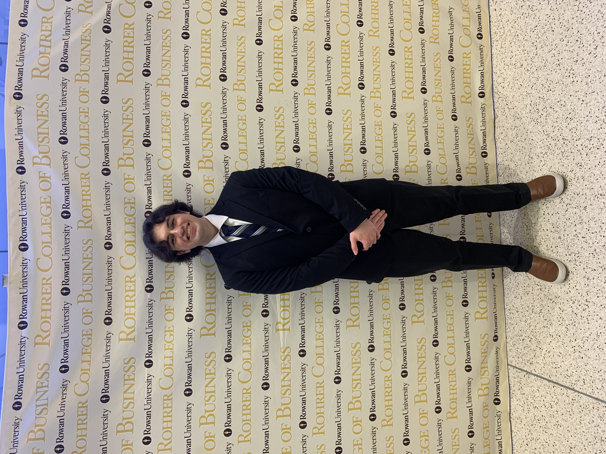

# About Me
{ align=right width=375}
Hello all, My name is Matthew Tobino. I am an undergrad student an Rowan Univeristy studying computer science. If anyone asks how I got into the sciences, the real answer is Tony Stark. The Marvel movies really made it look so simple to build new technology out of nothing. I am big into video games, anime, sports, and the gym. Video games have always been a big part of my life, ever since my dad let me play my first one alongside him (Mass Effect). My brother got me into anime after I complained that there wasn't enough action in the shows I was watching. After he showed me the stuff he was watching, I fell in love with the genre. I am not the best athelete by any means, but my friends love to play competitive sports, so I had to learn to keep up somehow. The gym has a special place for me as I find it to be a nice calming place and a place I can always rely on to better improve myself. 

??? note "Sports I Like to Play"
    * :basketball: Basketball
    * :soccer: Soccer
    * :man_playing_handball_tone1: Spikeball

??? note "Favorite Video Games"
    * :simple-playstation: Kingdom Hearts 2
    * :material-nintendo-switch: Super Mario Odyssey
    * :material-nintendo-switch: Legend of Zelda: Tears of the Kingdom 

!!! note "Honors and Awards"
    * :fontawesome-solid-graduation-cap: Upsilon Pi Epsilon - International Honor Society for the Computing and Information Disciplines
    * Presidential Scholars Of Excellence, Fall 2022-2023
    * Dean's List, 2020 - Spring 2022
    * Rowan Merit Scholarship

!!! note "Clubs and Associations"
    * :fontawesome-solid-graduation-cap: Senator for Upsilon Pi Epsilon - International Honor Society for the Computing and Information Disciplines
    * :snowboarder: Snowboard and Ski Club Member
    * :flag_ec: United Latino Association Member