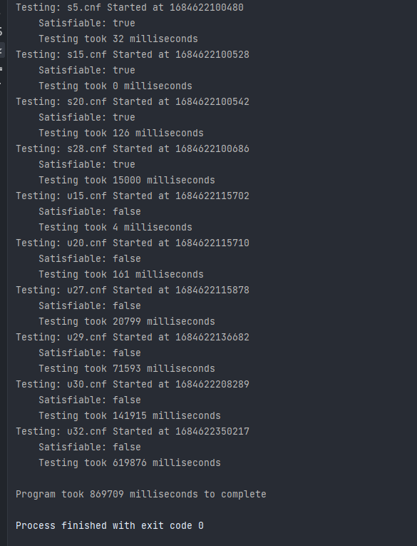

# Brute Force Project

## Description
The project will take a given CNF file and test all of the clauses using all possible combinations of the variables. If there is no solution, the program will output "Unsatisfiable," otherwise it will print "Satisfiable." The project utilizes the brute force solving algorithm and shows that it can be slow, especially when testing 
large files will a lot of input.

## CNF Input Files

The input files follow a CNF file format that the program can read through. The CNF header and a few lines are shown below

```
c A SAT instance that has 21 clauses and 5 variables
p cnf 5 21
-4 -3 5 0
-5 4 3 0
5 -2 1 0
3 -2 4 0
3 5 -4 0
```
The rest of the satisfiable file with 5 variables can be downloaded seen below.

[:material-text: CNF File with 5 variables](../../content/cnfFiles/s5.cnf){ .md-button .md-button--primary }

Another file with 32 variables that is unsatisfiable can be downloaded seen below.

[:material-text: CNF File with 32 variables](../../content/cnfFiles/u32.cnf){ .md-button .md-button--primary }

## Output

After the code runs, the program will output a message stating if the file was satisfiable, or unsatisfiable. It will also output how long the code took to test that file
and how long it took to run the entire program. 



## Project Link

The project is in a private repository at a professor's request because it is a school project but can be shared if requested.
If access is requested/granted, the project can be found below. 

[:simple-github: Project Link](https://github.com/mtobino/DAA_Projects/tree/master/src/main/java/bruteForceProjectRevised){ .md-button .md-button--primary }

