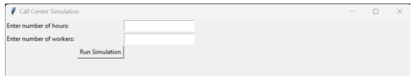
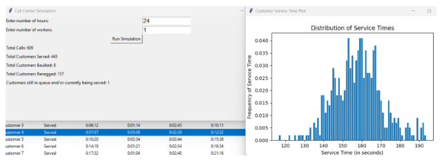
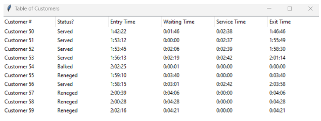

# Call Center Simulator

## Description
The program will simulate a call center based on the information gathered from a data file. The program will output the data of a call center running for X amount of hours with Y number of servers. X and Y will be provided by the user in the GUI. The data output will include the number of callers within X hours, the number of callers who were successfully served, the number of callers who balked, the number of callers who reneged, and the number of callers still in the queue by the end of the simulation. The program will also generate a Poisson distribution of the service times of the callers and a table to better show which callers left the queue early and why they did so.

## Contributors
[:simple-github: Matthew Tobino](https://github.com/mtobino){ .md-button .md-button--primary }
[:simple-github: Justin Pitera](https://github.com/justinpitera){ .md-button .md-button--primary }
[:simple-github: Sean Pandolfo](https://github.com/BunColo){ .md-button .md-button--primary }
[:simple-github: Andy Pham](https://github.com/Phamandy2000){ .md-button .md-button--primary }

## Input
The GUI will take in the information necessary

 

## Output
 

 

## Documentation and Report
The final report and documentation to the project can be downloaded

[:material-file-pdf-box: Final Deliverable](../../pdfs/Call%20Center%20Deliverable.pdf){ .md-button .md-button--primary }

## Project Link
Project is open and available to the public

[:simple-github: Project Link](https://github.com/mtobino/call-center-simulator){ .md-button .md-button--primary }
