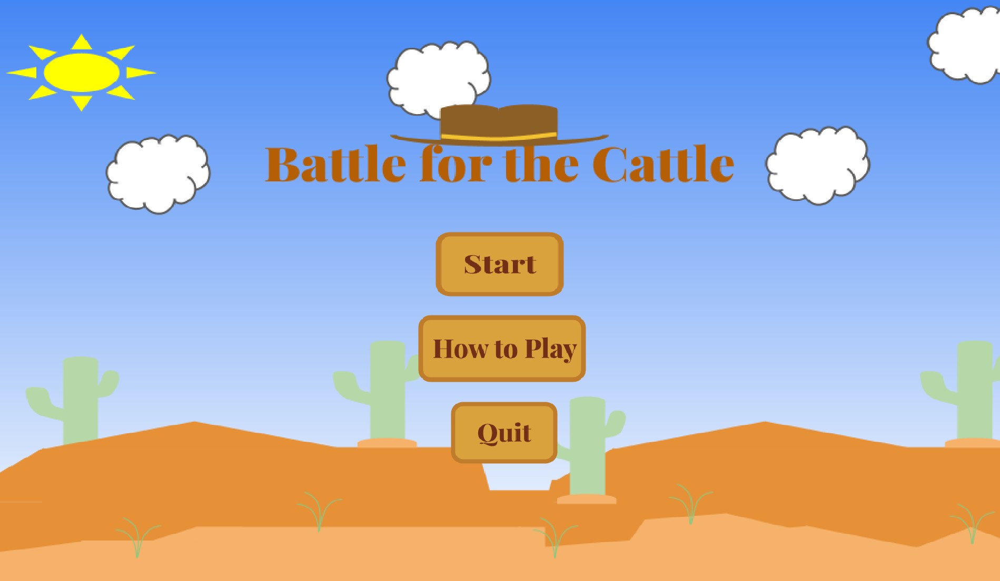
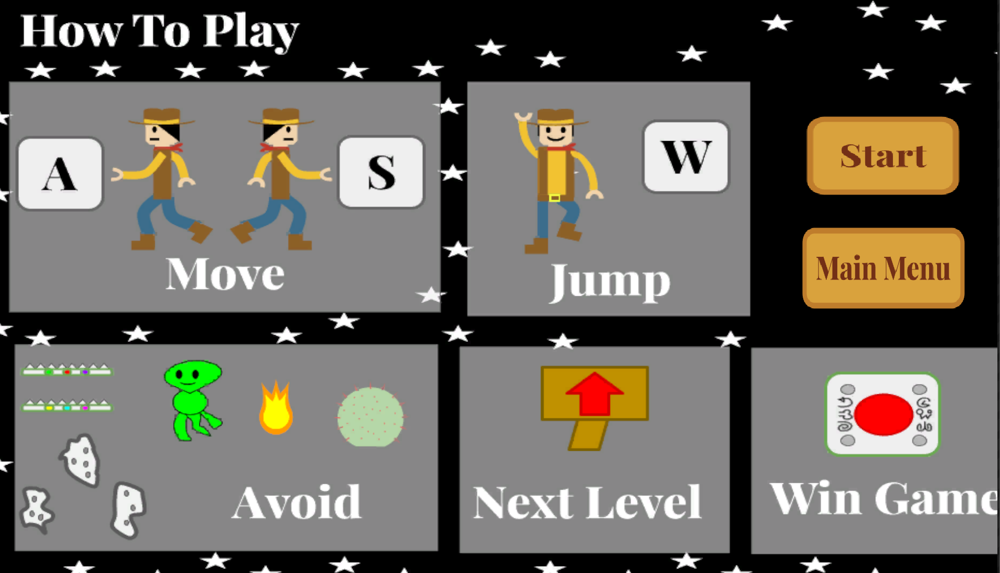
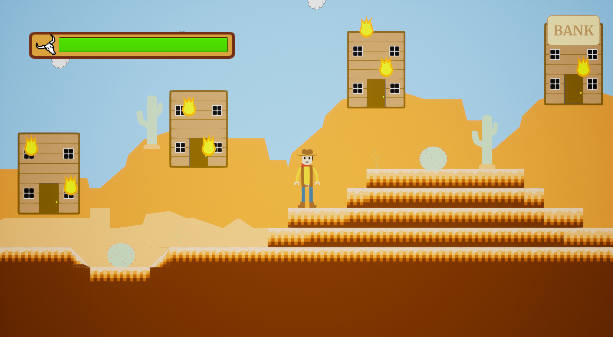
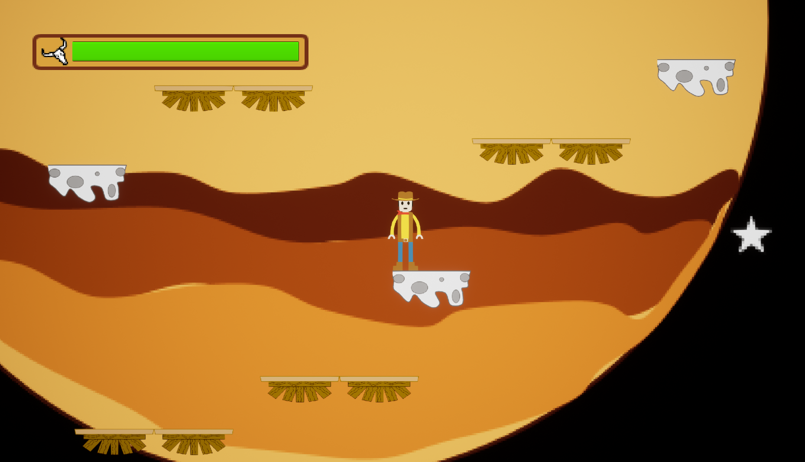
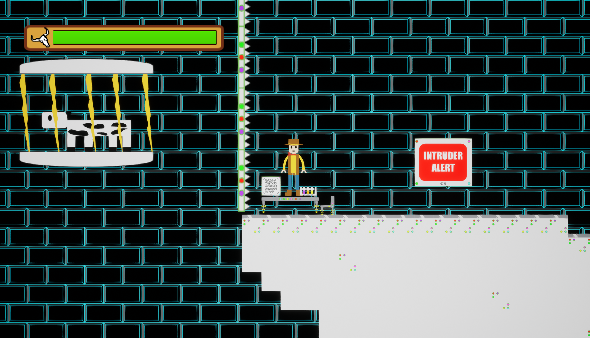
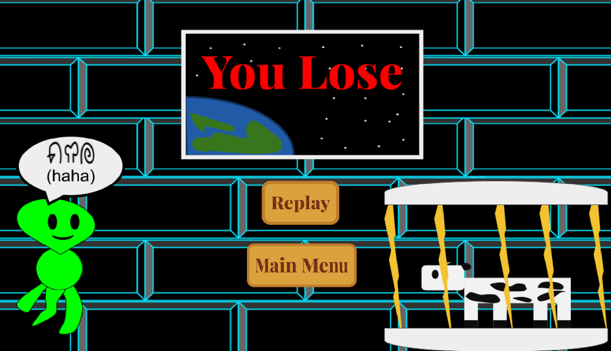
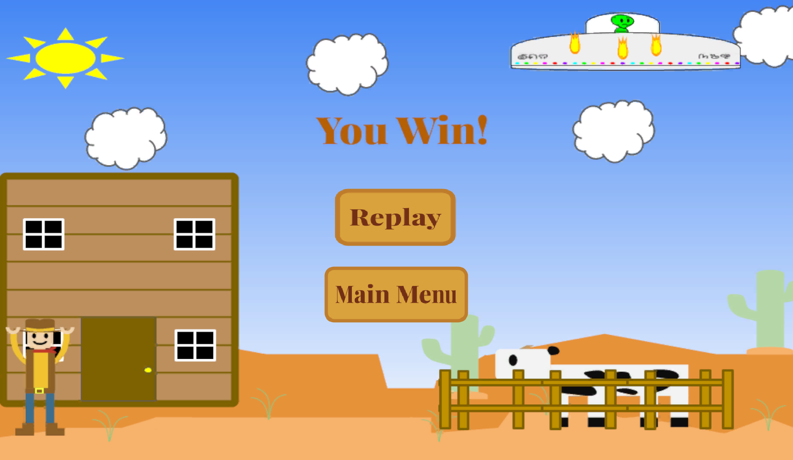

# Video Game Project

## Description
The goal of this project was to design, create, and code a video game from scratch. All of game art is created by me in Google Slides. The game is run on Unreal Engine 4. and the code is made using the Blueprints from the engine. The game is a 2D platforming game following a Cowboy who just had his livestock stolen by an Alien. The Cowboy must then traverse through three levels to chase the alien and eventually get his cow back. The Cowboy travels through his destroyed town, space, and the Alien ship to get his cattle back. 

## Start Menu

## How to Play Screen

## First Level Image

## Second Level Image

## Final Level Image 

## You Lose Screen

## You Win Screen

## Unreal Engine Files
[:material-folder-zip: Pending Professor Approval](#){ .md-button .md-button--primary }

## Game Trailer
<iframe width="560" height="315" src="https://www.youtube.com/embed/Oi8nNX__ctc" title="YouTube video player" frameborder="0" allow="accelerometer; autoplay; clipboard-write; encrypted-media; gyroscope; picture-in-picture; web-share" allowfullscreen></iframe>