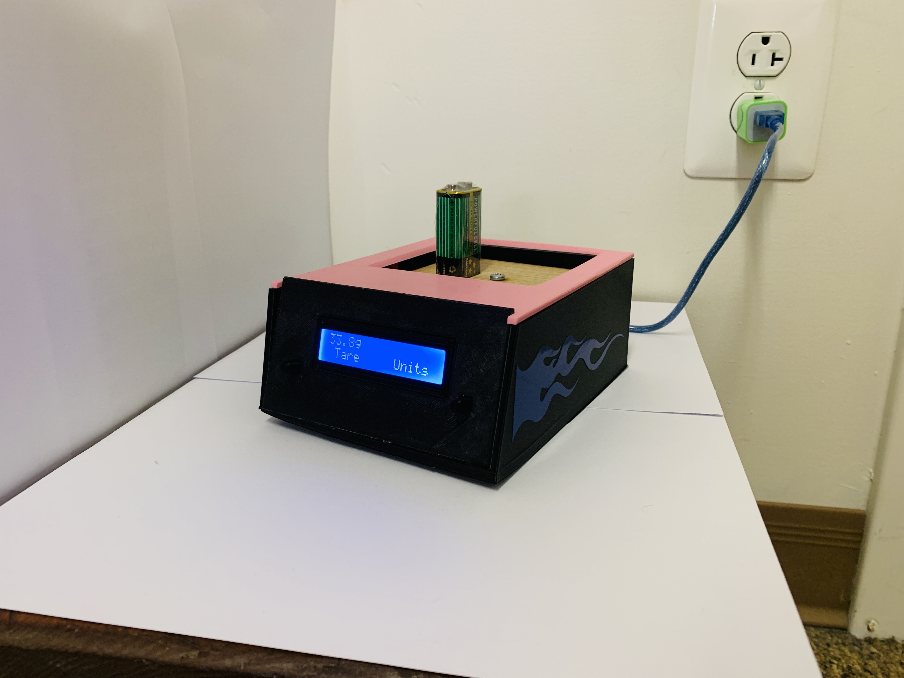

# Custom Scale Project

## Description
The goal of the project was to create a scale from mostlty scratch using parts we machined in class, a 3D printed frame, and an Arduino board with custom code to 
create a working scale. The scale must have teo buttons, one for taring and another to switch units from ounces to grams. 

## Final Product Drawing
[:material-file-pdf-box: SolidWorks CAD Drawing](../../pdfs/Tobino_Drawing.PDF){ .md-button .md-button--primary }

## Actual Final Product

## Instruction Manual
[:material-file-pdf-box: Instruction Manual PDF](../../pdfs/Tobino_Calibration.pdf){ .md-button .md-button--primary }

## Code
[:simple-arduino: Pending Professor Approval](#){ .md-button .md-button--primary }

## Product Reveal Video
[:simple-youtube: Link to Video](https://youtu.be/iGQjzYp8Jbc){ .md-button .md-button--primary }
