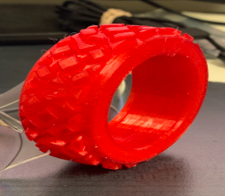

# Rubber Tire Project

## Description
The goal was to design a set of tires to be attached to an RC car and complete an obstacle course.

## Team Members 
[:simple-linkedin: Matthew Tobino](https://www.linkedin.com/in/matthew-tobino-704a631b8/){ .md-button .md-button--primary }
[:simple-linkedin: Noah Carey](https://www.linkedin.com/in/noah-carey-7644b9208/){ .md-button .md-button--primary }
[:simple-linkedin: Jason Repmann](https://www.linkedin.com/in/jason-repmann-86046223b/){ .md-button .md-button--primary }
[:material-email: Zachary Waldman](mailto:waldma63@students.rowan.edu){ .md-button .md-button--primary }
[:simple-linkedin: James MacAulay](https://www.linkedin.com/in/james-macaulay-7b529b230/){ .md-button .md-button--primary }

## Final Design

## Final Report on Design
The final report and documentation to the project can be downloaded or viewed below. 

[:material-file-pdf-box: Download/View Report](../../pdfs/TireProjectFinal.pdf){ .md-button .md-button--primary }

