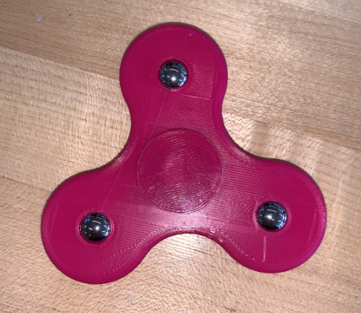

# Toy Project
This project required our team to design and build a toy that could be sold with a Happy Meal. We designed a fidget 
spinner that had ball bearings on the wings to add additional fidgeting capabilities. 

## Team Members
[:simple-linkedin: Matthew Tobino](https://www.linkedin.com/in/matthew-tobino-704a631b8/){ .md-button .md-button--primary }
[:simple-linkedin: Noah Carey](https://www.linkedin.com/in/noah-carey-7644b9208/){ .md-button .md-button--primary }
[:simple-linkedin: Jason Repmann](https://www.linkedin.com/in/jason-repmann-86046223b/){ .md-button .md-button--primary }
[:material-email: Zachary Waldman](mailto:waldma63@students.rowan.edu){ .md-button .md-button--primary }

## Final Design

## Final Report of Project
The final report and documentation to the project can be downloaded

[:material-file-pdf-box: Final Deliverable](../../pdfs/ToyProjectFinal.pdf){ .md-button .md-button--primary }