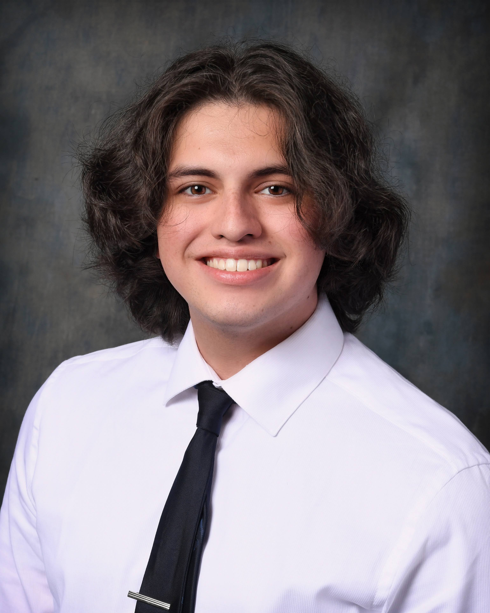

# Home

{ align=right width="200" }
I am recent graduate from Rowan University with a Bachelor's Degree in Computer Science and a Concentration in Software Engineering. I originally started out as a Mechanical Engineering Student, but I found I 
had a greater aptitude for coding than physics. However, that did not stop me from succeeding in the engineering courses as I have maintained Dean's List throughout every 
semester. I feel taking these engineering classes helped me to have an open mind toward my coding and helped me to tackle my problems in a better and more
efficient manner. I have graduated Summa Cum Laude and members of Upsilon Pi Epsilon and Pi Mu Epsilon.

## Resume
[:material-file-pdf-box: Resume](content/pdfs/Resume.pdf){ .md-button .md-button--primary }

## Skills

??? tip "Languages"
    * :material-language-java: Java
    * :simple-python: Python
    * :simple-javascript: JavaScript
    * :simple-html5: HTML
    * :material-code-json: JSON
    * :simple-css3: CSS
    * :simple-php: PHP
    * :simple-assemblyscript: MIPS Assembly Language
    * C/C++
    * :simple-markdown: Markdown
    * MatLab
    * :material-bash: Bash Scripting
    * :simple-arduino: Arduino
    * :simple-yaml: YAML
    * :material-file-xml-box: XML
    

??? tip "Database Languages"
    * :simple-mysql: MySQL
    * :simple-mongodb: MongoDB
    * :simple-neo4j: Neo4j
    * :simple-sqlite:SQLite

??? tip "Development Tools"
    * :simple-git:Git,  :simple-github: GitHub
    * :simple-intellijidea: IntelliJ IDEA
    * :material-microsoft-visual-studio-code: VS Code
    * :simple-eclipseide: Eclipse
    * :bootstrap-BlueJ-Logo: BlueJ
    * OpenRefine
    * :simple-powerbi: Microsoft PowerBI

??? tip "Platforms"
    * :material-microsoft-windows: Windows
    * :simple-linux: Linux
    * :material-microsoft-azure: Azure

??? tip "Project Methodologies"
    * Agile Scrum
    * Waterfall

??? tip "Relevant Coursework"
    * Data Structures and Algorithms
    * Design and Analysis of Algorithms
    * Artifical Intelligence
    * Database Systems and Programming
    * Operating Systems
    * Intro to Information Visualization
    * Computer Organization (MIPS Assembly Language) 
    * Computer Lab Techniques (C and Linux)
    * Discrete Structures
    * Foundations of Computer Science
    * Intro to Computer Game Design and Development
    * Intro to Scientific Programming MATLAB/CAD
    * Intro to Systems Simulation and Modeling
    * Intro to Object Oriented Programming (Java)
    * Object Oriented Programming and Data Abstraction (Java)
    * First-Year Engineering Clinic
    * Sophomore Engineering Clinic
    * Public Speaking

## Work Experience 
??? success "Rowan University, :octicons-location-16: Glassboro, NJ"
    

        
**Computer Science Department Tutor**

        
**:material-calendar-clock: Oct 2022 - Present**

    

    

    * Assisted Students with their studies in Computer Science Topics. 
    * Advise students on ways to optimize their code and create more efficient methods/functions.
    * Instructed students on effective manners of study, and ways to practice the topics that were reviewed. 
    * Classes mainly tutored for:
        * Object Oriented Programming and Data Abstraction
        * Intro to Object Oriented Programming (Java)
        * Intro to Scientific Programming - Java, Python, or C++
        * Foundations of Computer Science
        * Data Structures and Algorithms
        * Design Analysis of Algorithms
        * Computer Lab Techniques (C and Linux)

??? success "Flynn O'Hara Uniforms, :octicons-location-16: Holmdel, NJ"
     

        
**Sales Associate**

        
**:material-calendar-clock: Jun 2019 - Aug 2023**

    

    

    * Developed strong communication skills between team members, managers, and customers.
    * Helped acclimate new hires to their work environment.
    * Handled customer transactions and online orders at the cash register.
    * Provided aid to customers to get their uniforms in a quick and efficient manner.

??? success "Crown Car Wash, :octicons-location-16: Hazlet, NJ"
    

        
**Customer Sales Representative**

        
**:material-calendar-clock: Jun 2018 - Nov 2018**

    

    

    * Worked at the outdoor podium to take orders and send customers through the wash.
    * Developed communication skills with managers to seamlessly aid customers with their orders.
    * Cleaned the bay and pit of the car wash after the wash had closed.
